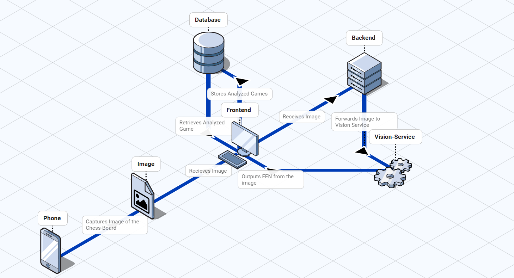

# ♛ ChessLens — AI Chess Analysis Web App

A full-stack chess analysis application:
- **Image recognition**: upload a photo of any physical board → auto-detect position
- **Stockfish 16 WASM**: instant in-browser engine analysis (no server round-trip)
- **Game library**: save, browse, and replay games
- **Google Auth**: sign in with Google via Firebase
- **Responsive**: works on phone and desktop

All free services. No paid APIs.

---

## Architecture



---

## Project Structure

```
chess-analyzer/
├── assets/
├── frontend/            # React + Vite SPA
│   └── src/
│       ├── components/  # Navbar, Board, AnalysisPanel etc.
│       ├── hooks/       # useStockfish, useAuth
│       ├── pages/       # Landing, Analyze, Games, GameDetail
│       ├── services/    # Firestore CRUD
│       └── workers/     # Stockfish Web Worker
├── backend/             # Express API(proxies to vision-service)
├── vision-service/      # Python Flask + OpenCV + PyTorch CNN
├── firestore.rules      # Security rules
└── firebase.json        # Firebase Hosting config
```


## Key Tech Decisions

| Choice | Reason |
|--------|--------|
| Stockfish WASM in browser | No server cost, no latency, full depth analysis |
| Firebase Auth | Free Google OAuth without building your own auth server |
| Firestore | Free tier (50k reads/day); no SQL setup |
| MobileNetV3-Small | Fast, accurate, runs on CPU — no GPU needed for inference |
| React + Vite | Fast dev server, great ecosystem, HMR |
| Render.com | Free hobby tier for always-on Node/Python services |

---

## Firestore Database Schema

```
Firestore
│
└── users/                          ← top-level collection
    └── {uid}/                      ← one document per Google user
        │    (uid = Firebase Auth user ID)
        │
        └── games/                  ← subcollection inside each user
            └── {gameId}/           ← auto-generated document ID
                  title:     string
                  notes:     string
                  fen:       string   ← board position at save time
                  pgn:       string   ← full game in PGN format
                  moves:     array    ← ["e4", "e5", "Nf3", ...]
                  createdAt: timestamp
                  updatedAt: timestamp
```

---
