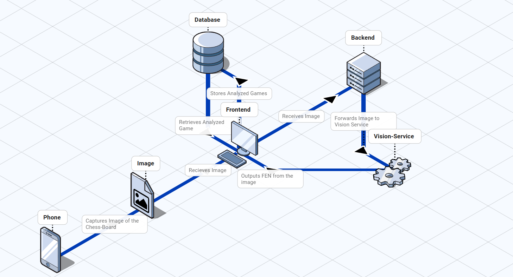

# ChessLens — AI Chess Analysis Web App

A full-stack chess analysis application built with React, Stockfish WASM, Firebase, and a custom PyTorch vision model.

     

 https://github.com/user-attachments/assets/39c41993-1a05-45a3-8eb7-51b6a2df6cc1

---

## Architecture



---

## Project Structure

```
chess-analyzer/
├── assets/
├── frontend/                  # React + Vite SPA
│   └── src/
│       ├── components/        # Navbar, AnalysisPanel, EvalGraph,
│       │                      # SaveGameModal, PgnImportModal, ImageUpload
│       ├── hooks/             # useStockfish, useAuth, useOpening, useTheme
│       ├── pages/             # Landing, Analyze, Games, GameDetail, Patterns
│       ├── services/          # Firestore CRUD, patternRecognition
│       └── workers/           # Stockfish Web Worker (loaded from /public)
├── backend/                   # Express API (proxies to vision-service)
├── vision-service/            # Python Flask + OpenCV + PyTorch CNN
├── firestore.rules            # Security rules
└── firebase.json              # Firebase Hosting config
```

---

## Key Tech Decisions

| Choice | Reason |
|--------|--------|
| Stockfish WASM in browser | No server cost, no latency, full depth analysis |
| Stockfish.js via local /public | Avoids CDN dependency and CORS issues in Workers |
| Firebase Auth | Free Google OAuth without building your own auth server |
| Firestore | Free tier (50k reads/day); no SQL setup |
| MobileNetV3-Small | Fast, accurate, runs on CPU — no GPU needed for inference |
| React + Vite | Fast dev server, great ecosystem, HMR |
| Cloudflare Pages | Edge hosting, automatic GitHub deploys, free tier |
| Cloudflare Workers | Proxy backend — no spin-down, 100k requests/day free |
| Render.com | Vision service hosting — free hobby tier for Python/Flask |

---

## Features in Detail

### Opening Detection
After each move, the position is matched against 80+ ECO openings sorted by specificity. The opening name and ECO code appear below the page title as soon as the position is recognised.

### Evaluation Graph
Plots centipawn scores across every move using Recharts. Hover any point to see the move, evaluation, and quality label. Click any point to jump directly to that position. Blunders and mistakes are highlighted as coloured dots on the line.

### Move Quality Classification
Each move is compared to the previous evaluation from the moving side's perspective and classified using standard thresholds:

| Label | Centipawn drop |
|-------|---------------|
| Best | 0 |
| Good | 0 to -30 |
| Inaccuracy | -30 to -100 |
| Mistake | -100 to -300 |
| Blunder | worse than -300 |

### Pattern Recognition
Stockfish analyses every saved game in batch, evaluating each position at depth 10. Patterns detected include phase-based mistake rates (opening, middlegame, endgame), piece-specific weaknesses, late-game accuracy collapse, and overall accuracy. Each pattern includes a plain-English explanation and actionable advice. Analysis runs entirely in the browser — no backend required.

### PGN Import
Paste any PGN directly into the Import PGN tab next to the board. The PGN is parsed live using chess.js and a preview card shows players, event, date, move count, and result before importing. The Immortal Game is included as a built-in example.

### Share Position
The Share button encodes the current FEN into the URL query string and copies it to clipboard. Anyone opening the link lands directly on that board position.

---

## Recognition Model

Detects chess pieces from board images and outputs FEN strings.

### Model Characteristics

| Property | Value |
|----------|-------|
| Architecture | MobileNetV3-Small |
| Input | 64x64 RGB cell image |
| Output | 13-class prediction (K Q R B N P k q r b n p .) |
| Parameters | ~1.5M |
| Weights file | model_weights.pth |

### Dataset

| Property | Value |
|----------|-------|
| Dataset | ChessRender360 (kaggle.com/datasets/mmkoya/chessrender360) |
| Total images | 10,000 rendered chess positions |
| Image size | 2000x2000 RGB |
| Cell samples | 640,000 (64 per image) |
| Annotation | Board corners + FEN per image used for exact perspective warp |

### Training

| Property | Value |
|----------|-------|
| Epochs | 30 |
| Batch size | 128 |
| Learning rate | 1e-3 |
| Optimizer | Adam |
| Scheduler | StepLR (step=10, gamma=0.5) |
| Device | Tesla T4 GPU (Kaggle notebook) |
| Platform | Kaggle notebook |

### Inference Pipeline

1. Photo is uploaded from the browser and sent to the Flask server
2. find_board() detects the board quadrilateral via contour detection and perspective-warps it to 512x512
3. The board is sliced into 64 cells, one per square
4. MobileNetV3 classifies each cell into one of 13 classes
5. Predictions are assembled into a valid FEN string via python-chess

### Output Format

```json
{
  "fen": "rnbqkbnr/pppppppp/8/8/4P3/8/PPPP1PPP/RNBQKBNR b KQkq e3 0 1",
  "confidence": 0.87
}
```

---

## Firestore Database Schema

```
Firestore
└── users/
    └── {uid}/
        └── games/
            └── {gameId}/
                  title:     string
                  white:     string   (white player name)
                  black:     string   (black player name)
                  notes:     string
                  fen:       string   (board position at save time)
                  pgn:       string   (full game in PGN format)
                  moves:     array    (["e4", "e5", "Nf3", ...])
                  createdAt: timestamp
                  updatedAt: timestamp
```

---

## Hosting

| Service | What it hosts |
|---------|--------------|
| Cloudflare Pages | React frontend — auto-deploys on every GitHub push |
| Cloudflare Workers | Express backend proxy |
| Render.com | Python Flask vision service |
| Firebase | Authentication + Firestore database |

The Cloudflare Pages _redirects file handles both SPA routing and API proxying:

```
/api/*  https://your-backend.onrender.com/api/:splat  200
/*      /index.html  200
```

---

## How to Run Locally

Clone the repo and start the frontend:

```bash
git clone https://github.com/epsilon003/chess-lens.git
cd chess-lens/frontend
npm install
npm run dev
```

The frontend runs at http://localhost:5173. Stockfish, Firebase Auth, and Firestore all work without the backend or vision service running.

To run the vision service locally:

```bash
cd vision-service
python -m venv venv
venv\Scripts\Activate.ps1          # Windows
pip install -r requirements.txt
python app.py                       # runs on http://localhost:8000
```

The backend proxy is only needed in production to forward /api requests to the vision service. In local development, Vite proxies /api to localhost:5000 automatically.
